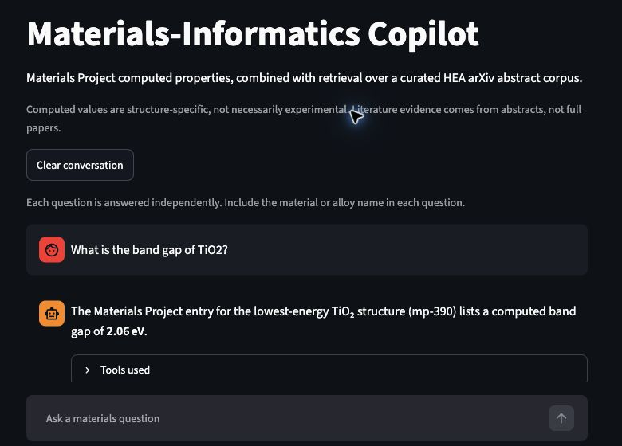
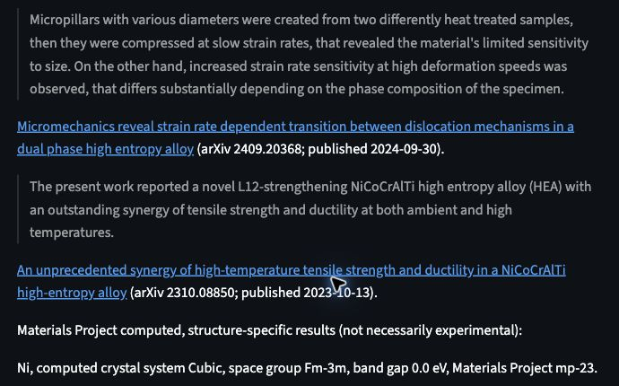
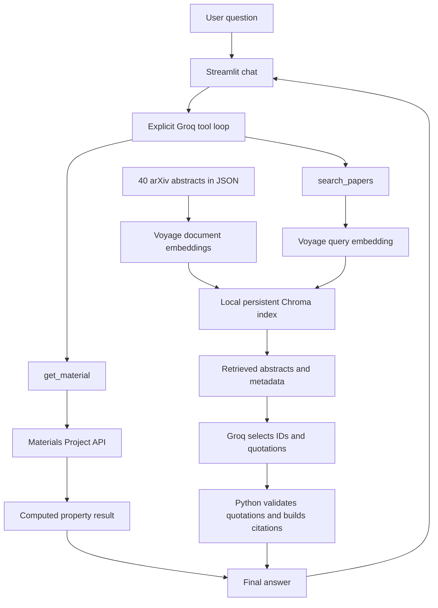

# Materials-Informatics Copilot

A materials-science assistant that combines **Materials Project computed properties**
with **retrieval over 40 high-entropy-alloy (HEA) arXiv abstracts**. An explicit Groq
tool loop chooses the appropriate source, and a quotation validator keeps literature
answers tied to retrieved evidence.

**[Try the live demo](https://materials-co-pilot-98fjuetvpp95rfso9zjqyd.streamlit.app/)**
· [Architecture](#how-it-works)
· [Engineering decisions](#engineering-decisions)
· [Validation](#tests-and-evaluation)
· [Local setup](#run-locally)

## Why this project

Materials questions often require both a property value and the scientific context
around it. A database lookup supplies structured values; literature retrieval
supplies reported observations. This project brings both into one interface while
keeping their sources and limitations visible.

For example, a single question can ask for Ni's computed crystal system and the
mechanical behavior reported for Ni-containing HEAs. The answer separates the
Materials Project record from quoted abstract evidence and links to the sources.

## At a glance

| Capability | Implementation |
| --- | --- |
| Two-source question answering | Materials Project property lookup and HEA literature search |
| Explicit tool orchestration | Argument validation, multiple calls, bounded rounds, and safe failures |
| Persistent retrieval | 40 normalized arXiv abstracts, Voyage embeddings, local Chroma storage |
| Grounded literature output | Validated source quotations, metadata-built citations, one selection retry |
| Deployed interface | Streamlit chat with source links, tool labels, and session history |
| Validation | 100 passing automated tests; a separate 16-case live evaluation |

This is an applied AI engineering project using existing models and APIs, not a
newly trained model. The emphasis is on reliable integration, inspectable evidence,
failure handling, and testing. Computed properties are not presented as experimental
measurements, and abstract retrieval is not presented as full-paper analysis.

## Demo

Materials Project lookup:



Excerpt from a mixed answer: verified abstract quotations, source links, and a
separate Materials Project result for Ni.



These screenshots were captured from the deployed app on 23 September 2026.
They show individual successful runs, not a guarantee that every response will be
identical or complete.

Try these questions:

- What is the band gap of TiO2?
- What deformation mechanisms are reported in dual-phase high-entropy alloys?
- What is the crystal system of Ni according to Materials Project, and what mechanical behavior is reported for Ni-containing high-entropy alloys?

The first literature request may take a few minutes while the app initializes its
local vector index. Each question is answered independently; displayed conversation
history is not passed back to the agent as memory.

## How it works



1. Groq chooses `get_material(formula)`, `search_papers(query, k=4)`, both, or no tool.
2. The loop validates tool arguments and handles multiple calls, bounded repeated
   rounds, unknown tools, malformed JSON, and tool failures without an agent framework.
3. Materials Project results select the structure with the lowest energy above hull
   among returned matches. The response includes its material ID and computed properties.
4. Literature search embeds the query with Voyage and retrieves nearby abstracts
   from Chroma using cosine distance.
5. For literature answers, the model selects a retrieved arXiv ID and a supporting
   quotation. Python matches the quotation against that abstract after limited
   whitespace/Unicode normalization. Invalid or empty selections get one retry;
   another failure produces a safe evidence-limit answer.
6. Citation titles, URLs, IDs, and dates come from retrieved metadata. Mixed answers
   retain valid computed results even when literature evidence is insufficient.

After a literature result, the loop switches to evidence selection rather than
requesting further tools. Quote matching limits unsupported wording; it does not
prove that a passage is relevant or fully answers the question.

## Stack

| Component | Implementation |
| --- | --- |
| UI | Streamlit; session-only chat history |
| Tool orchestration | Python and Groq SDK, `openai/gpt-oss-120b` |
| Computed properties | Materials Project via `mp-api` |
| Literature corpus | arXiv metadata and abstracts |
| Embeddings | Voyage AI, `voyage-4-lite` |
| Vector retrieval | Persistent local ChromaDB |
| Testing | pytest, mocked external APIs, Streamlit AppTest |
| Hosting | Streamlit Community Cloud, Python 3.12 |

## Engineering decisions

| Decision | Reason and tradeoff |
| --- | --- |
| Direct Python orchestration | Keeps two-tool routing and error handling easy to inspect without an agent framework. |
| Complete abstracts as retrieval documents | Keeps ingestion and citation provenance simple, but excludes detailed methods and full-paper results. |
| Validate quotations in code | Rejects invented IDs and unsupported passages; answers are more conservative than free-form summaries. |
| Retry evidence selection once | Recovers from malformed JSON or harmless quotation-format differences while bounding latency and cost. |
| Preserve mixed-answer components independently | A literature gap should not discard a successful Materials Project lookup. |
| Initialize missing indexes on first search | Supports deployment without committing vectors; the first literature request can be slower. |
| Separate offline tests from live evaluation | Tests run without API credits; live checks exercise real model behavior but are not scientific accuracy scores. |

## Tests and evaluation

Run the offline suite without spending API credits:

```bash
.venv/bin/python -m pytest -q
```

Latest local verification on 23 September 2026: **100 tests passed**.

The suite covers ingestion, real temporary Chroma storage with mocked embeddings,
tool orchestration, quotation validation and retries, mixed answers, evaluation
utilities, UI history, and safe errors. Root-level `test_*.py` scripts are separate
live probes and are excluded by `pytest.ini`.

The 16-case evaluation covers property lookup, literature, mixed questions,
ambiguity, invalid formulas, and out-of-domain requests. Run it deliberately:

```bash
.venv/bin/python evaluate.py
```

This consumes API requests and replaces `eval/results.json`. The stored report
completed on 19 September 2026 has **16/16 tool-selection matches**, **7/7 required
citation checks**, and **zero execution errors**. These are mechanical checks,
not scientific accuracy scores. Citation presence is not proof of relevance,
correctness, or completeness. There is no LLM-as-a-judge scoring.
See [evaluation methodology](eval/README.md) and the [saved report](eval/results.json).

## Run locally

Use Python 3.12. From the repository directory on macOS/Linux:

```bash
python3.12 -m venv .venv
.venv/bin/python -m pip install -r requirements.txt
cp .env.example .env
```

Edit the ignored `.env` file locally and supply your own `MP_API_KEY`,
`GROQ_API_KEY`, and `VOYAGE_API_KEY`. Never commit credentials.

```bash
.venv/bin/python -m streamlit run app.py
```

Using `python -m streamlit` from this virtual environment avoids accidentally
launching a globally installed Streamlit with different dependencies.

The committed `data/hea_papers.json` corpus is sufficient to start. A missing or
empty expected Chroma collection is indexed automatically before a literature
search. Subsequent searches reuse it. To build or refresh it explicitly:

```bash
.venv/bin/python rag.py index
.venv/bin/python rag.py search "HEA strength and ductility" -k 4
```

To replace the corpus with a fresh arXiv query, then rebuild its embeddings:

```bash
.venv/bin/python ingest_arxiv.py
.venv/bin/python rag.py index
```

Ingestion requests about 40 papers using
`cat:cond-mat.mtrl-sci AND all:"high entropy alloy" AND all:mechanical`, normalizes
metadata, and deduplicates by arXiv ID. Refreshing can change the corpus and answers.
Indexing and live questions make external API calls and may incur provider charges
or hit rate limits. See [retrieval details](RETRIEVAL.md).

## Streamlit Community Cloud

Deploy `app.py` from the repository with Python 3.12 and `requirements.txt`.
In the app's **Settings → Secrets**, provide these **root-level TOML strings**:

```toml
MP_API_KEY = "replace-with-your-key"
GROQ_API_KEY = "replace-with-your-key"
VOYAGE_API_KEY = "replace-with-your-key"
```

Keep the quotes and do not put the keys under a section heading. Save and reboot
the app after changing credentials. The local `.env` file is not deployed.
See [Streamlit secrets documentation](https://docs.streamlit.io/develop/concepts/connections/secrets-management).

`chroma_db/` stays Git-ignored. Cloud can rebuild it from the committed corpus when
local storage is missing; it is not a managed remote database or a durable backup.
An existing index is not rebuilt on every request. After changing the corpus,
explicitly rebuild the index rather than assuming it refreshes automatically.

The UI shows a generic error on an uncaught failure. Application logging records
only the exception module/class, never the exception message, traceback, key
values, or user question. Internal grounding diagnostics belong to evaluation
reports and are not displayed in chat.

## Repository guide

| File | Purpose |
| --- | --- |
| `app.py` | Streamlit chat, safe errors, tool labels |
| `copilot.py` | Groq tool loop and grounded literature renderer |
| `tools.py` | Materials Project lookup |
| `ingest_arxiv.py` | Corpus collection and metadata normalization |
| `rag.py` | Voyage embeddings, index initialization, Chroma search |
| `data/hea_papers.json` | Source corpus: abstracts and citation metadata |
| `evaluate.py`, `eval/` | Inspectable live evaluation cases and reports |
| `tests/` | Offline automated tests |

## Limitations and next work

- Computed properties are structure-specific; choosing one match does not describe
  every polymorph or experimental condition.
- The corpus is a small query-selected snapshot of arXiv abstracts, not a systematic
  review, full-paper corpus, or assurance of peer review.
- Literature answers intentionally quote evidence rather than inventing missing
  mechanisms, numerical results, or experimental details.
- Cosine distance is a retrieval metric, not calibrated confidence.
- Provider/model changes, rate limits, and Cloud restarts can affect availability.
  Dependency versions are constrained only partly, not locked reproducibly.
- The demo has no authentication, persistent user accounts, or durable chat history.

Future work could measure retrieval relevance with human-reviewed examples,
support explicit polymorph selection, and improve evidence coverage. Those are
separate milestones; full-PDF retrieval and additional agent frameworks are not
part of this version.
